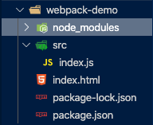
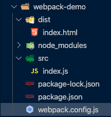
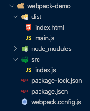
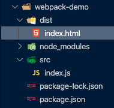

# Webpack Demo


## About

Webpack is a static module bundler for JavaScript applications. It builds a dependency graph mapping modules in your project and generates one or more bundles.

There are 6 Core Concepts in Webpack to understand.


## The 6 Core Concepts


### Entry

The entry point indicates which module Webpack should use to begin building its dependency graph. It will then figure out which other modules it depends on (directly or indirectly).

By default the value is ./src/index.js, but different entry points can be set by setting an entry property in the config file. For example:


```
module.exports = {
  entry: './path/to/my/entry/file.js'
};
```


### Output

The output property indicates where to emit the bundles it creates and how to name these files. It defaults to ./dist/main.js for the main output file and to the ./dist folder for any other generated file, though this can be configured by specifying an output field in your configuration. For example:


```
const path = require('path');

module.exports = {
  entry: './path/to/my/entry/file.js',
  output: {
    path: path.resolve(__dirname, 'dist'),
    filename: 'my-first-webpack.bundle.js'
  }
};
```


This should be relatively straightforward to understand, a directory path is specified to place the output file in, and a filename is defined. The path module imported at the top allows us to use methods such as resolve() and constants such as __dirname.


### Loaders

Out of the box, webpack only understands JavaScript and JSON files. Loaders allow webpack to process other types of files and convert them into modules that can be consumed by your application.

Loaders have two main properties in a webpack configuration:


*   The test property identifies the file type to be transformed.
*   the use property identifies the loader that should be used to transform.

```
const path = require('path');

module.exports = {
  output: {
    filename: 'my-first-webpack.bundle.js'
  },
  module: {
    rules: [
      { test: /\.txt$/, use: 'raw-loader' }
    ]
  }
};
```


### Plugins

Loaders transform certain types of modules, and plugins can perform a wider range of tasks such as bundle optimization, asset management and environment variable injection.

To use a plugin, you need to require() it and add it to the plugins array. use the new operator to create an instance of each plugin.

```
const HtmlWebpackPlugin = require('html-webpack-plugin'); //installed via npm

const webpack = require('webpack'); //to access built-in plugins

module.exports = {
  module: {
    rules: [
      { test: /\.txt$/, use: 'raw-loader' }
    ]
  },
  plugins: [
    new HtmlWebpackPlugin({template: './src/index.html'})
  ]
};
```


### Mode

The mode parameter can be set to development, production or none in order to enable webpack’s built-in optimizations that correspond to each environment. Default is production.


### Browser Compatibility

Webpack supports all browsers that are ES5-compliant. It also needs Promise for import() and require.ensure().


## Getting Started


### Basic Setup

First I created a typical npm project, with two main files inside - index.html and src/index.js. The project structure looks like this:



*   My guess for why index.html is outside is because it’s used as a template file, rather than a javascript source file. index.js is what webpack will really be working with to create the bundles.
*   The text for each of the files will be displayed here:


#### index.js


```
function component() {
  const element = document.createElement('div');
  // Lodash, currently included via a script, is required for this line to work
  element.innerHTML = _.join(['Hello', 'webpack'], ' ');

  return element;
}

document.body.appendChild(component());
```


#### index.html


```
<!DOCTYPE html>
<html lang="en">
<head>
    <meta charset="UTF-8">
    <meta name="viewport" content="width=device-width, initial-scale=1.0">
    <meta http-equiv="X-UA-Compatible" content="ie=edge">
    <title>Getting Started</title>
    <script src="https://unpkg.com/lodash@4.16.6"></script>
</head>
<body>
    <script src="./src/index.js"></script>
</body>
</html>
```


#### package.json


```
{
  "name": "webpack-demo",
  "version": "1.0.0",
  "description": "",
  "private": true,
  "scripts": {
    "test": "echo \"Error: no test specified\" && exit 1"
  },
  "keywords": [],
  "author": "",
  "license": "ISC",
  "devDependencies": {
    "webpack": "^4.41.5",
    "webpack-cli": "^3.3.10"
  },
  "dependencies": {
    "lodash": "^4.17.15"
  }
}
```


Running this will work, but it’s not ideal, as it doesn’t follow the law of separation of concerns (lodash is being imported in the html file, rather than in index.js) and index.js is just assuming that there’s a global variable in the state, which is very dangerous.


### Creating a Bundle

The next step is to make sure that index.js is able to have all its requirements stated in its own file, rather than relying on some global variable that’s just polluting the workspace. The project structure is also going to be tweaked a little.


#### The dist/ folder

This folder will be created in order to place all the code that will be distributed to production. index.html will be placed here, and its code tweaked to remove the lodash import, and to change the imported script from index.js to main.js, which will be outputted by webpack.

The new directory structure will look like this:



#### Import bundle

Next, lodash will be installed via npm as a module, and placed into dependencies. index.js will then have an import statement at the top in order to use its functionalities.

#### src/index.html

```
<!DOCTYPE html>
<html lang="en">
<head>
    <meta charset="UTF-8">
    <meta name="viewport" content="width=device-width, initial-scale=1.0">
    <meta http-equiv="X-UA-Compatible" content="ie=edge">
    <title>Getting Started</title>
</head>
<body>
    <script src="main.js"></script>
</body>
</html>
```

#### index.js

```
import _ from 'lodash';

function component() {
  const element = document.createElement('div');

  element.innerHTML = _.join(['Hello', 'webpack'], ' ');

  return element;
}

document.body.appendChild(component());
```


### Modules

Be aware that Webpack will only alter import and export statements out of the box. If you want to use other ES2015 features, a transpiler such as Babel should be used as a loader.


### Using a Configuration

Out of the box, webpack doesn’t need configuration. However, when you start using more complex features, a configuration file may be needed. To do this, a new file called webpack.config.js is created at the root directory:


<p id="gdcalert3" ><span style="color: red; font-weight: bold">>>>>>  gd2md-html alert: inline image link here (to images/Webpack2.png). Store image on your image server and adjust path/filename if necessary. </span><br>(<a href="#">Back to top</a>)(<a href="#gdcalert4">Next alert</a>)<br><span style="color: red; font-weight: bold">>>>>> </span></p>




#### webpack.config.js

```
const path = require('path');

module.exports = {
    entry: './src/index.js',
    output: {
        filename: 'main.js',
        path: path.resolve(__dirname, 'dist')
    }
};
```

You can then run it using `npx webpack --config webpack.config.js`

A note about this: the --config webpack.config.js flag is not actually needed in this specific case as webpack.config.js is the default config file name that webpack will look for.

### npm Scripts

To create a shortcut, we can edit package.json to use a script:

#### package.json

```
{
  "name": "webpack-demo",
  "version": "1.0.0",
  "description": "",
  "private": true,
  "scripts": {
    "test": "echo \"Error: no test specified\" && exit 1",
    "build": "webpack"
  },
  "keywords": [],
  "author": "",
  "license": "ISC",
  "devDependencies": {
    "webpack": "^4.41.5",
    "webpack-cli": "^3.3.10"
  },
  "dependencies": {
    "lodash": "^4.17.15"
  }
}
```

We can then use `npm run build` to create the distribution files.

### Conclusion

This is a basic setup of a webpack project. Next we’ll be working with assets such as images and fonts. The project now looks like this:


