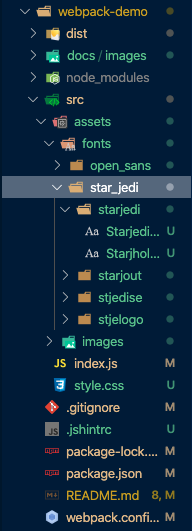

# Webpack Demo

## About

Webpack is a static module bundler for JavaScript applications. It builds a dependency graph mapping modules in your project and generates one or more bundles.

There are 6 Core Concepts in Webpack to understand.

## The 6 Core Concepts

### Entry

The entry point indicates which module Webpack should use to begin building its dependency graph. It will then figure out which other modules it depends on (directly or indirectly).

By default the value is ./src/index.js, but different entry points can be set by setting an entry property in the config file. For example:

```javascript
module.exports = {
  entry: './path/to/my/entry/file.js'
};
```

### Output

The output property indicates where to emit the bundles it creates and how to name these files. It defaults to ./dist/main.js for the main output file and to the ./dist folder for any other generated file, though this can be configured by specifying an output field in your configuration. For example:

```javascript
const path = require('path');

module.exports = {
  entry: './path/to/my/entry/file.js',
  output: {
    path: path.resolve(__dirname, 'dist'),
    filename: 'my-first-webpack.bundle.js'
  }
};
```

This should be relatively straightforward to understand, a directory path is specified to place the output file in, and a filename is defined. The path module imported at the top allows us to use methods such as resolve() and constants such as __dirname.

### Loaders

Out of the box, webpack only understands JavaScript and JSON files. Loaders allow webpack to process other types of files and convert them into modules that can be consumed by your application.

Loaders have two main properties in a webpack configuration:

* The test property identifies the file type to be transformed.
* The use property identifies the loader that should be used to transform.

```javascript
const path = require('path');

module.exports = {
  output: {
    filename: 'my-first-webpack.bundle.js'
  },
  module: {
    rules: [
      { test: /\.txt$/, use: 'raw-loader' }
    ]
  }
};
```

### Plugins

Loaders transform certain types of modules, and plugins can perform a wider range of tasks such as bundle optimization, asset management and environment variable injection.

To use a plugin, you need to require() it and add it to the plugins array. use the new operator to create an instance of each plugin.

```javascript
const HtmlWebpackPlugin = require('html-webpack-plugin'); //installed via npm

const webpack = require('webpack'); //to access built-in plugins

module.exports = {
  module: {
    rules: [
      { test: /\.txt$/, use: 'raw-loader' }
    ]
  },
  plugins: [
    new HtmlWebpackPlugin({template: './src/index.html'})
  ]
};
```

### Mode

The mode parameter can be set to development, production or none in order to enable webpack’s built-in optimizations that correspond to each environment. Default is production.

### Browser Compatibility

Webpack supports all browsers that are ES5-compliant. It also needs Promise for import() and require.ensure().

## Getting Started

### Basic Setup

First I created a typical npm project, with two main files inside - index.html and src/index.js. The project structure looks like this:


* My guess for why index.html is outside is because it’s used as a template file, rather than a javascript source file. index.js is what webpack will really be working with to create the bundles.
* The text for each of the files will be displayed here:

`index.js`

```javascript
function component() {
  const element = document.createElement('div');
  // Lodash, currently included via a script, is required for this line to work
  element.innerHTML = _.join(['Hello', 'webpack'], ' ');

  return element;
}

document.body.appendChild(component());
```

`index.html`

```html
<!DOCTYPE html>
<html lang="en">
<head>
    <meta charset="UTF-8">
    <meta name="viewport" content="width=device-width, initial-scale=1.0">
    <meta http-equiv="X-UA-Compatible" content="ie=edge">
    <title>Getting Started</title>
    <script src="https://unpkg.com/lodash@4.16.6"></script>
</head>
<body>
    <script src="./src/index.js"></script>
</body>
</html>
```

`package.json`

```json
{
  "name": "webpack-demo",
  "version": "1.0.0",
  "description": "",
  "private": true,
  "scripts": {
    "test": "echo \"Error: no test specified\" && exit 1"
  },
  "keywords": [],
  "author": "",
  "license": "ISC",
  "devDependencies": {
    "webpack": "^4.41.5",
    "webpack-cli": "^3.3.10"
  },
  "dependencies": {
    "lodash": "^4.17.15"
  }
}
```

Running this will work, but it’s not ideal, as it doesn’t follow the law of separation of concerns (lodash is being imported in the html file, rather than in index.js) and index.js is just assuming that there’s a global variable in the state, which is very dangerous.

### Creating a Bundle

The next step is to make sure that index.js is able to have all its requirements stated in its own file, rather than relying on some global variable that’s just polluting the workspace. The project structure is also going to be tweaked a little.

#### The dist/ folder

This folder will be created in order to place all the code that will be distributed to production. index.html will be placed here, and its code tweaked to remove the lodash import, and to change the imported script from index.js to main.js, which will be outputted by webpack.

The new directory structure will look like this:


#### Import bundle

Next, lodash will be installed via npm as a module, and placed into dependencies. index.js will then have an import statement at the top in order to use its functionalities.

`src/index.html`

```html
<!DOCTYPE html>
<html lang="en">
<head>
    <meta charset="UTF-8">
    <meta name="viewport" content="width=device-width, initial-scale=1.0">
    <meta http-equiv="X-UA-Compatible" content="ie=edge">
    <title>Getting Started</title>
</head>
<body>
    <script src="main.js"></script>
</body>
</html>
```

`index.js`

```javascript
import _ from 'lodash';

function component() {
  const element = document.createElement('div');

  element.innerHTML = _.join(['Hello', 'webpack'], ' ');

  return element;
}

document.body.appendChild(component());
```

### Modules

Be aware that Webpack will only alter import and export statements out of the box. If you want to use other ES2015 features, a transpiler such as Babel should be used as a loader.

### Using a Configuration

Out of the box, webpack doesn’t need configuration. However, when you start using more complex features, a configuration file may be needed. To do this, a new file called webpack.config.js is created at the root directory:


`webpack.config.js`

```javascript
const path = require('path');

module.exports = {
    entry: './src/index.js',
    output: {
        filename: 'main.js',
        path: path.resolve(__dirname, 'dist')
    }
};
```

You can then run it using `npx webpack --config webpack.config.js`

A note about this: the --config webpack.config.js flag is not actually needed in this specific case as webpack.config.js is the default config file name that webpack will look for.

### NPM Scripts

To create a shortcut, we can edit package.json to use a script:

`package.json`

```json
{
  "name": "webpack-demo",
  "version": "1.0.0",
  "description": "",
  "private": true,
  "scripts": {
    "test": "echo \"Error: no test specified\" && exit 1",
    "build": "webpack"
  },
  "keywords": [],
  "author": "",
  "license": "ISC",
  "devDependencies": {
    "webpack": "^4.41.5",
    "webpack-cli": "^3.3.10"
  },
  "dependencies": {
    "lodash": "^4.17.15"
  }
}
```

We can then use `npm run build` to create the distribution files.

### Conclusion

This is a basic setup of a webpack project. Next we’ll be working with assets such as images and fonts. The project now looks like this:


Find the link to the directory [here](https://github.com/AQUIN0S/webpack-demo/tree/5181fa17b44aade7c2ffa073e55ace209fd78b10 "Webpack Getting Started").

## Asset Management

Being able to include any other type of file, as long they have a loader, is one of the core features of Webpack. Before, front-end developers used tools like grunt and gulp to process assets and move them from /src to /dist or /build directories. However, Webpack is able to dynamically bundle all dependencies, where modules explicitly state their dependencies, so that we don't bundle modules that aren't in use.

We'll begin with adding CSS files.

### Setup

First we'll just make some changes to our project, changing the source dist file to be bundle.js, in order to be clearer about its purpose:

`dist/index.html`

```html
<!DOCTYPE html>
<html lang="en">
<head>
    <meta charset="UTF-8">
    <meta name="viewport" content="width=device-width, initial-scale=1.0">
    <meta http-equiv="X-UA-Compatible" content="ie=edge">
    <title>Asset Management</title>
</head>
<body>
    <script src="bundle.js"></script>
</body>
</html>
```

`webpack.config.js`

```javascript
const path = require('path');

module.exports = {
    entry: './src/index.js',
    output: {
        filename: 'bundle.js',
        path: path.resolve(__dirname, 'dist')
    }
};
```

### Loading CSS

In order to `import` a CSS file from within a JavaScript module, `style-loader` and `css-loader` are needed:

```bash
npm install --save-dev style-loader css-loader
```

`webpack.config.js`

```javascript
const path = require('path');

module.exports = {
    entry: './src/index.js',
    output: {
        filename: 'bundle.js',
        path: path.resolve(__dirname, 'dist')
    },
    module: {
        rules: [
            {
                test: /\.css$/,
                use: [
                    'style-loader',
                    'css-loader'
                ]
            }
        ]
    }
};
```

> So I believe.... that this is just specifying that when exporting a module, if a .css file is encountered in an import, then it will first need to go through the style-loader and the css-loader programs first.

This should mean that we can use `import './style.css'` in a file that depends on that styling. What I'm not entirely sure on though, is why a JavaScript file would need to import a style. I guess I'll have to just keep reading....

Let's add a new `style.css` file to our project and import it in `index.js`:


`src/style.css`

```css
.hello {
  color: red;
}
```

`src/index.js`

```javascript
import _ from 'lodash';
import './style.css';

function component() {
  const element = document.createElement('div');

  element.innerHTML = _.join(['Hello', 'webpack'], ' ');
  element.classList.add('hello');

  return element;
}

document.body.appendChild(component());
```

Now run the build:

```bash
npm run build
```

And open up `index.html` in the browser. You'll see that the text is highlighted in red, using the css file passed to the javascript module. Note that the css file isn't referenced whatsoever in index.html.

> Note that it's also good practice to [minimise css](https://webpack.js.org/plugins/mini-css-extract-plugin/#minimizing-for-production "Minimising CSS") for better production load times.

### Loading Images

It's similar with images that you might want to use for backgrounds and icons. The loader used here is called file-loader, so we'll install that:

```bash
npm install --save-dev file-loader
```

Next we'll edit the config file to recognise image files:

`webpack.config.js`

```javascript
const path = require('path');

module.exports = {
    entry: './src/index.js',
    output: {
        filename: 'bundle.js',
        path: path.resolve(__dirname, 'dist')
    },
    module: {
        rules: [
            {
                test: /\.css$/,
                use: [
                    'style-loader',
                    'css-loader'
                ]
            },
            {
                test: /\.(png|svg|jpe?g|gif)$/,
                use: [
                    'file-loader'
                ]
            }
        ]
    },
    mode: 'development'
};
```

I'm going to use an image from one of my favourite spots to add to the webpage:


`src/index.js`

```javascript
import _ from 'lodash';
import './style.css';
import Cliffside from './images/Cliffside.jpg';

function component() {
  const element = document.createElement('div');

  element.innerHTML = _.join(['Hello', 'webpack'], ' ');
  element.classList.add('hello');

  const myImage = new Image(500, 500);
  myImage.src = Cliffside;

  const imageWrapper = document.createElement('div');
  imageWrapper.classList.add("imageWrapper");

  element.appendChild(document.createElement("br"));
  element.appendChild(imageWrapper);
  element.appendChild(myImage);

  return element;
}

document.body.appendChild(component());
```

`src/style.css`

```css
.hello {
    color: red;
}

.imageWrapper {
    width: 500px;
    height: 500px;
    background: url('./images/Lakeside.jpg') no-repeat center center;
    background-size: cover;
}
```

Also notice how in the dist/ folder, the image would have changed names to some unintelligable string. This is just a thing that happens apparently.

> The next step would be to minify and optimize any used images. [`image-webpack-loader`](https://github.com/tcoopman/image-webpack-loader "Image Webpack Loader") and [`url-loader`](https://webpack.js.org/loaders/url-loader "URL Loader") would be useful for that.

### Loading Fonts

The file and url loaders will take any file and output to the build directory, including fonts.

We can update `webpack.config.js` to handle font files then:

`webpack.config.js`

```javascript
const path = require('path');

module.exports = {
    entry: './src/index.js',
    output: {
        filename: 'bundle.js',
        path: path.resolve(__dirname, 'dist')
    },
    module: {
        rules: [
            {
                test: /\.css$/,
                use: [
                    'style-loader',
                    'css-loader'
                ]
            },
            {
                test: /\.(png|svg|jpe?g|gif)$/,
                use: [
                    'file-loader'
                ]
            },
            {
                test: /\.(woff2?|eot|ttf|oft)$/,
                use: [
                    'file-loader'
                ]
            }
        ]
    },
    mode: 'development'
};
```

We then add font files to the project:



And edit `src/style.css` to use a font:

`src/style.css`

```css
@font-face {
    font-family: 'star-wars';
    /*
     * I initially had a format() method here - don't do that...
     */
    src: url("./assets/fonts/star_jedi/starjedi/Starjedi.ttf");
}

.hello {
    color: red;
}

.imageWrapper {
    width: 500px;
    height: 500px;
    background: url('./assets/images/Lakeside.jpg') no-repeat center center;
    background-size: cover;
}

.starWarsHeader {
    font-family: 'star-wars';
    color: black;
}
```

### Loading Data

Other useful assets are data files such as JSON, CSV, TSV and XML. JSON support is already supported out of the box, meaning `import Data from ./data.json` will work by default. CSVs, TSVs and XML can be imported using `csv-loader` and `xml-loader`.

Yeah I'll give this a go. First install these packages:

```bash
npm install --save-dev csv-loader xml-loader
```

Then add new rules to your config file to handle these new file types:

`webpack.config.js`

```javascript
const path = require('path');

module.exports = {
    entry: './src/index.js',
    output: {
        filename: 'bundle.js',
        path: path.resolve(__dirname, 'dist')
    },
    module: {
        rules: [
            {
                test: /\.css$/,
                use: [
                    'style-loader',
                    'css-loader'
                ]
            },
            {
                test: /\.(png|svg|jpe?g|gif)$/,
                use: [
                    'file-loader'
                ]
            },
            {
                test: /\.(woff2?|eot|ttf|oft)$/,
                use: [
                    'file-loader'
                ]
            },
            {
                test: /\.(csv|tsv)$/,
                use: [
                    'csv-loader'
                ]
            },
            {
                test: /\.xml$/,
                use: [
                    'xml-loader'
                ]
            }
        ]
    },
    mode: 'development'
};
```
